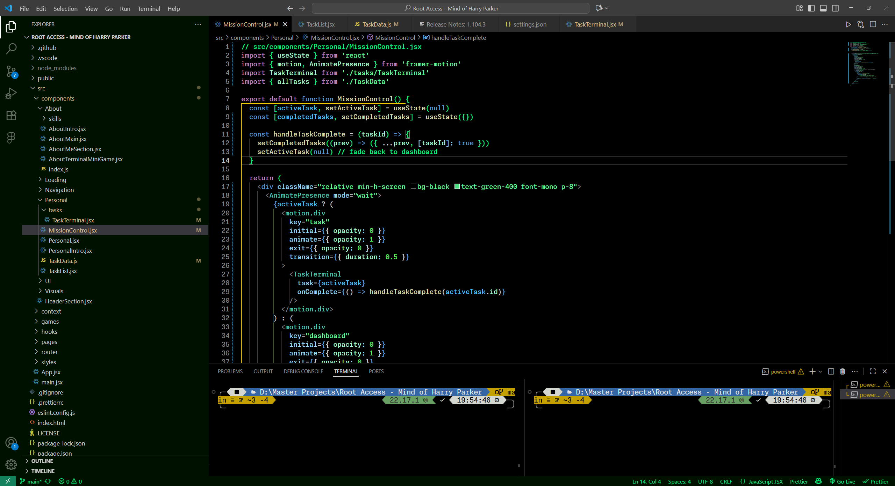

# 🦜 Parrot Terminal Theme for VS Code

> A ParrotOS-inspired hacker-style theme with neon green text, black background, and cyber-terminal vibes.



## ✨ Features

- True ParrotOS-style green-on-black interface
- Consistent syntax highlighting tuned for clarity
- Minimal eye strain for late-night hacking
- Great contrast for terminal-heavy workflows

## 🚀 Installation

1. Download the `.vsix` file or clone this repo.
2. In VS Code, open Command Palette → `Extensions: Install from VSIX...`
3. Select your `.vsix` file.
4. Apply the theme via `Ctrl+K Ctrl+T` → choose **Parrot Terminal**.

## 📦 Build From Source

```bash
npm install -g vsce
vsce package
```

## 💚 Credits

Inspired by ParrotOS and designed for developers who love a hacker aesthetic.
